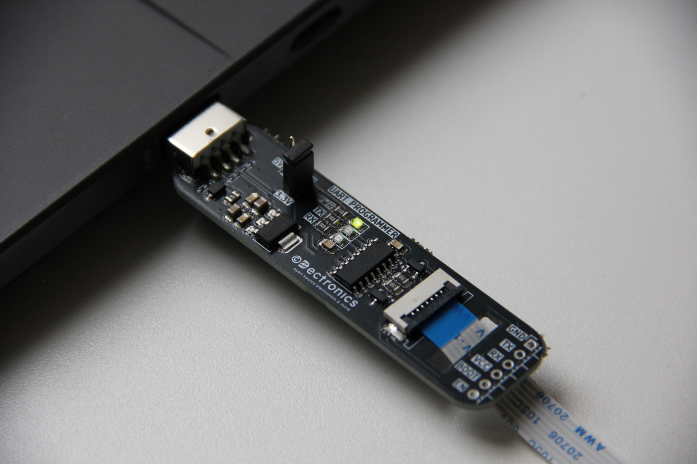
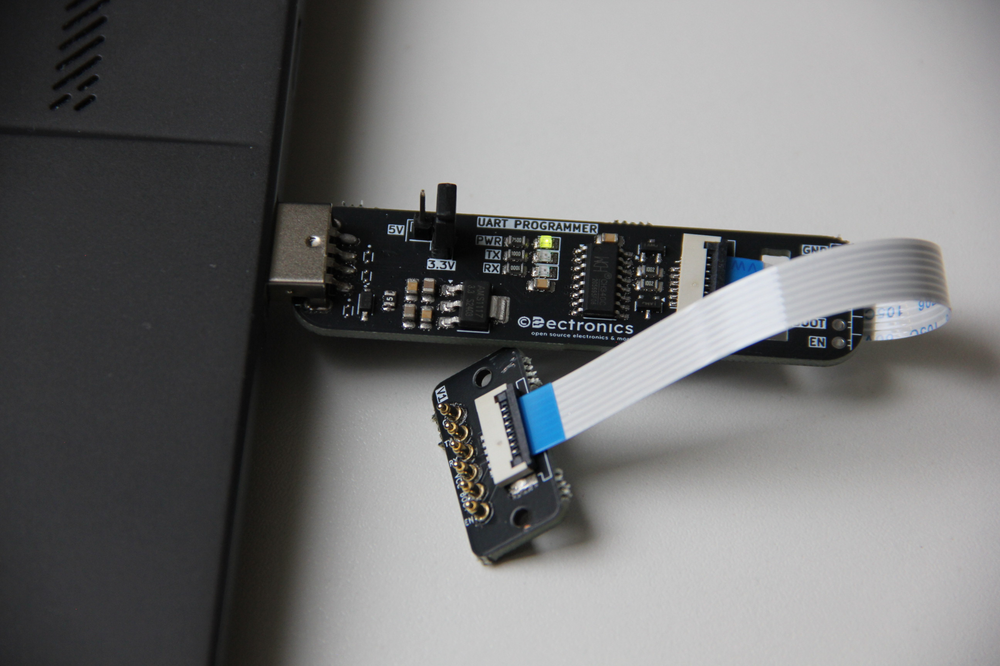
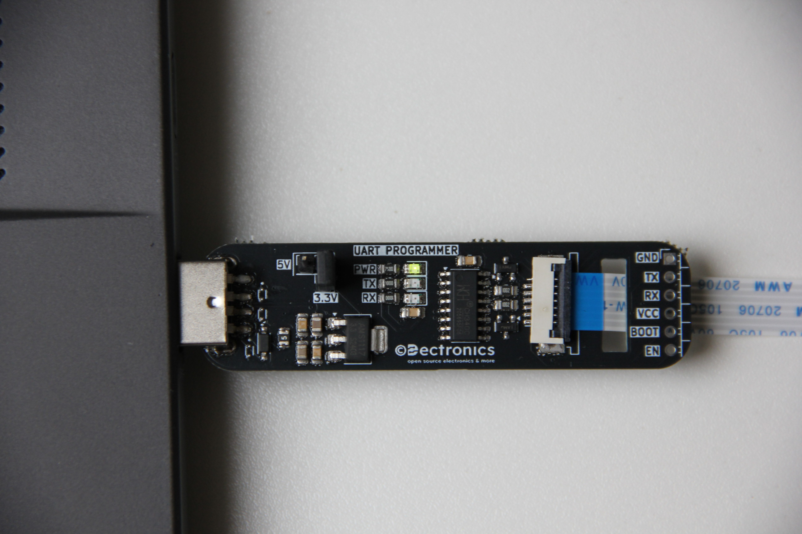

# Custom UART Programmer

A versatile UART programming board designed for microcontroller development with flexible voltage selection and multiple connection options. Features built-in status LEDs, CH340C USB-to-serial conversion, and support for external programming fixtures.

## **Hardware Overview**

- **USB-to-Serial IC:** CH340C for reliable USB communication
- **Voltage Selection:** Jumper-selectable 3.3V or 5V operation
- **Status Indicators:**
    - Power LED (PWR)
    - TX/RX activity LEDs
- **Connection Options:**
    - Standard pin headers for jumper wire connections
    - FCP slot for external fixtures
- **Interface:** Standard UART (TX, RX, VCC, GND, BOOT, EN)
- **Power Supply:** USB-powered with onboard voltage regulation

## **Schematic**

## **Getting Started**

1. **Driver Installation**
    
    - Install CH340 drivers for your operating system
    - Windows: Download from manufacturer or use Windows Update
    - macOS/Linux: Usually plug-and-play
2. **Voltage Selection**
    
    - Set jumper to 3.3V for ESP32, ESP8266, and other 3.3V microcontrollers
    - Set jumper to 5V for Arduino and 5V-compatible devices
3. **Connection Methods**
    
    **Method A: Direct Jumper Connections**
    
    - Connect VCC to target microcontroller's power pin
    - Connect GND to target ground
    - Connect TX to target RX pin
    - Connect RX to target TX pin
    - Use BOOT and EN pins for programming mode control (ESP32/ESP8266)
    
    **Method B: External Programming Fixture**
    
    - Insert compatible pogo pin module into FCP slot
    - Align fixture with target board
    - Programming connections are made automatically
4. **Programming**
    
    - Open your preferred serial terminal or IDE
    - Select the correct COM port
    - Set appropriate baud rate (typically 115200)
    - Put target microcontroller in programming mode
    - Upload firmware
5. **Status Monitoring**
    
    - PWR LED indicates power is applied
    - TX LED flashes during data transmission
    - RX LED flashes during data reception

**More Projects:** Visit [dectronics.cc](https://dectronics.cc/) for additional electronics projects
